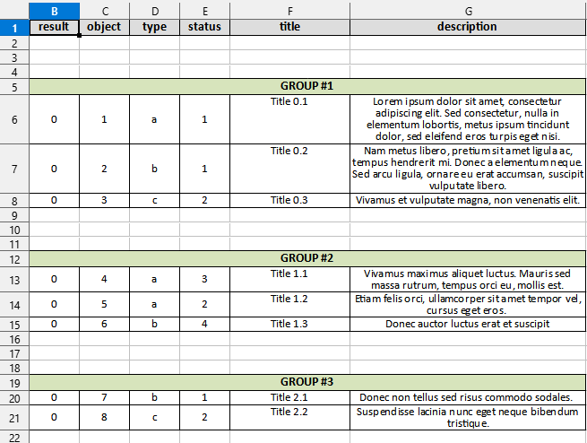

# pandastoxlsx

The class exports a dataframe into XLSX-file splitting it into groups using single column.  

The general use of the class is described in the following detailed example:

```python
from pandastoxlsx import PandasToXLSX
import pandas as pd

df = pd.read_csv("example.csv")

export_config = {'columns': {
    'group': {'options': {'hidden': True}},
    'result, object, type, status': {
        'format': {'text_wrap': True,
                   'valign': 'vcenter',
                   'align': 'center',
                   'bold': False},
        'width': 8},
    'title':
        {'format': {'text_wrap': True,
                    'valign': 'top',
                    'align': 'center',
                    'font_size': 11},
         'width': 20},
    'description':
        {'format': {'text_wrap': True,
                    'valign': 'top',
                    'align': 'center',
                    'font_size': 11},
         'width': 40}
}}
exporter = PandasToXLSX(df, 'example.xlsx', "group", export_config)
exporter.export()


```

Output:  


